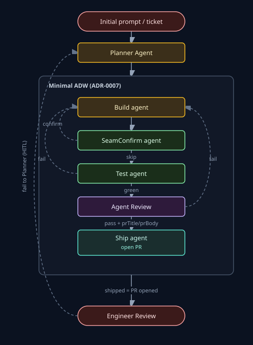
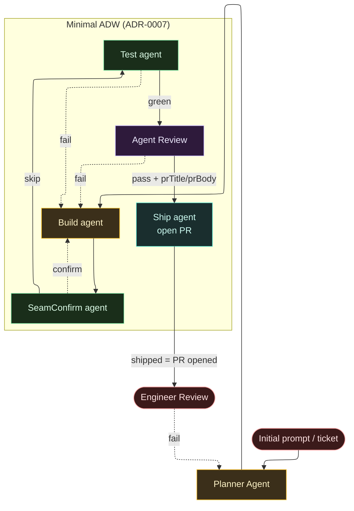

# Factory vision + v0/v1 cut

Canonical product vision for the extractable open-source **Factory**. Glossary lives in [`CONTEXT.md`](../CONTEXT.md); hard decisions live in [`docs/adr/`](adr/). This file is the cut and north star — not a second glossary.

Status: **locked** for this map — [Factory vision + v0 cut](https://github.com/luchillo17/lazy-software-factory/issues/26). Implement against this file + `CONTEXT.md` + `docs/adr/`.

## 1. North star

Extractable open-source **Factory** (`packages/runtime` + `packages/adw`, plus git-host seam): orchestrated AI developer workflows with hard gates, usable locally, on-prem, or as packages. The Factory is **self-building** — it develops this repo through its own ADWs.

Hosted multi-org **Organization** Platform is a later packaging of the same core (org-scoped credentials and compute), not the v0 lead. Sketch only in §6.

## 2. Domain primitives

- **Agent** (configured): reusable LLM role primitive; owns **Skill pack** + **Role skill binding** (plus transitive skill refs). Distinct from **Agent session**.
- **Skill pack**: default root `.agents/skills`. Organization custom packs = later hosted overlay on the same Agent primitive.
- **ADW**: composable graph of Agents, deterministic gates, and/or nested ADWs. Never wrap a single Agent as a one-node ADW.
- **Minimal ADW**: Build ↔ SeamConfirm ↔ Test agent → Review → Ship agent (ADR-0007 shape). Test, SeamConfirm, and Ship are **Code agents** (schema in; not LLMs). Canonical colored flow: [ADR-0007](adr/0007-minimal-adw-build-test-review.md). **TicketIntake** (Host CLI) sits _before_ that graph: ready Issue → `ticketId` + prompt; not a Minimal ADW node.
- **Feature ADW**: Planner Agent → nested Minimal ADW (one shared **warm sandbox**; Ship agent stays on Minimal after Review pass). Planner emits a **`/to-plan`** artifact into ADW/warm-sandbox state; Minimal consumes it. Feature ticket intake (Planner around a tracer ticket) is separate from Host Minimal **TicketIntake**.

**Human layout:** [`docs/diagrams/feature-adw.svg`](diagrams/feature-adw.svg) (+ shared [`adw-legend.svg`](diagrams/adw-legend.svg)). **Agents:** read the Mermaid graph below — not the SVG. Keep Mermaid and SVG semantically aligned. Colors: [`docs/README.md` — ADW diagram colors](README.md#adw-diagram-colors). Exhaustion bubble (Minimal → Planner, plan-only) omitted — see Feature Review-fail routing table below.

Ship **opens the PR** inside Minimal; it does **not** merge or deploy. Dashed fail inside Minimal → Build (local resume). SeamConfirm confirm → Build (no Build attempt). Engineer Review fail → Planner (HITL) is in Mermaid + SVG.

- **Role skill binding**: soft guidance loaded into the session (Cursor SDK has no skills API — binding invented in ADW prompts; pack discovery is workspace filesystem). Hard pass/fail stays ADW gates (ADR-0001). Optional **suggested skills** inside a plan are hints only — the configured Agent’s Role skill binding remains authoritative (matters more when cloud tenants customize Agents).

### Feature intake vs Planning/PM ADW

- **Upstream (HITL today; later Planning/PM ADW):** grill → spec → tickets. Building that ADW is out of this map (§7); compose principle is in scope.
- **Feature ADW intake:** tracer-bullet **ticket required**; parent **spec/feature issue attached when present**. Planner plans _around_ that ticket — does not re-run grill/spec/ticket minting.

### Feature Review-fail routing (provisional)

Locked in [Decide Feature Review-fail routing vs Minimal local loop](https://github.com/luchillo17/lazy-software-factory/issues/33). Eval design: [research #32](https://github.com/luchillo17/lazy-software-factory/issues/32) / `docs/agents/research/feature-review-fail-eval.md`.

| Case                                          | Policy                                                                                                                                            |
| --------------------------------------------- | ------------------------------------------------------------------------------------------------------------------------------------------------- |
| Minimal is **root**                           | Local Review-fail → Build resume (ADR-0007 / ADR-0009)                                                                                            |
| Nested under Feature — **Agent Review-fail**  | **Local** — resume Build inside Minimal (not each-fail bubble to Planner)                                                                         |
| Nested under Feature — Minimal **exhaustion** | Bubble to Planner for **plan-only** re-entry (rewrite slice / instructions); Build still owns code; then retry nested Minimal or Feature `failed` |

Agent Review-fail stays local (not Planner). Engineer Review fail → Planner is the separate HITL loop — in Feature Mermaid + SVG.

**Finalize when:** Track A static gold routing + Track B stub/CI dynamic compare local/bubble/tiered; root-Minimal invariance must hold (#32 decision rule). Until then this provisional stands.

### Default Role skill bindings

Locked in charting (#28 Build/Review; [#34](https://github.com/luchillo17/lazy-software-factory/issues/34) Planner).

| Agent   | Binding                                                                                                                                                                                                                                                                                                                                                                             |
| ------- | ----------------------------------------------------------------------------------------------------------------------------------------------------------------------------------------------------------------------------------------------------------------------------------------------------------------------------------------------------------------------------------- |
| Build   | Root `/implement` in session prompt; transitive skills follow from that skill on disk (pack must include them). Do **not** force `/setup-matt-pocock-skills` in Build bootstrap.                                                                                                                                                                                                    |
| Review  | Root `/adw-review` (Factory skill: ticket-branch diff, findings + `ReviewOutput`, no self-fix). Not Cursor `/review-bugbot` (no Bugbot subagent / PR checkout).                                                                                                                                                                                                                     |
| Planner | Roots `/codebase-design` + `/domain-modeling`; output skill **`/to-plan`** (custom: handoff discipline + Cursor `.plan.md`-like overview/todos/body). Write plan into warm-sandbox/ADW state (not OS temp). Optional suggested-skills section allowed; Agent Role binding still authoritative. **SKILL.md for `to-plan` ships with Feature ADW impl** — vision names the bind only. |

**Planner excludes (not in Role binding):** `/implement`, `/tdd`, `/code-review`, `/adw-review`, `/grilling`, `/wayfinder`, `/prototype`, `/to-tickets`, `/to-spec`, and using raw `/handoff` as the sole output path.

## 3. v0 cut

Acceptance criteria for **Minimal ADW** v0 green (self-building this repo on **Host sandbox**). Locked in [Define v0 Minimal ADW acceptance cut](https://github.com/luchillo17/lazy-software-factory/issues/28).

### Must pass

- [x] **Automated Minimal ADW tests** cover provision → Build ↔ Test → Review → Ship on Host (adapters/fakes OK), including:
  - [x] Happy path can yield **`shipped`** (PR URL recorded) — `packages/adw` `run-minimal-adw.spec.ts`
  - [x] Ship miss yields **`ready_for_pr`** without failing the agent loop / burning Build or Review attempts (ADR-0011) — `ship-ready-for-pr.spec.ts`
  - [x] Build↔Test and Review attempt caps behave per ADR-0009 — `build-test-cap.spec.ts`, `review-routing.spec.ts`
- [x] **One documented manual self-build** on this repo: a real `ready-for-agent` Issue runs through Host Minimal ADW and reaches **`shipped`** (live PR) — [`docs/host-self-build.md`](host-self-build.md) (proven: [#42](https://github.com/luchillo17/lazy-software-factory/issues/42) → [PR #63](https://github.com/luchillo17/lazy-software-factory/pull/63))
- [x] **Intake:** thin operator/CLI (or app) starts Minimal ADW from one GitHub Issue labelled `ready-for-agent` (Issue id + body → `ticketId` / prompt) — not full triage automation; diagram: TicketIntake → Prompt in [ADR-0007](adr/0007-minimal-adw-build-test-review.md) (outside the Build↔Ship spine) — [#37](https://github.com/luchillo17/lazy-software-factory/issues/37), `pnpm adw:host -- --issue`
- [x] **Build Role skill binding:** session bootstrap injects root `/implement` (flat skills + work; no role speech, no closure laundry list, no forced `/setup-matt-pocock-skills`); pack root `.agents/skills` present on agent cwd — [#38](https://github.com/luchillo17/lazy-software-factory/issues/38), `role-skill-binding.ts`
- [x] **Review Role skill binding:** session bootstrap injects root `/adw-review`; Host bundles that skill (`packages/adw/host-skill-pack`) onto agent `local.dirs` (target cwd need not vendor it); Build still requires `.agents/skills` on cwd for `/implement` — [#38](https://github.com/luchillo17/lazy-software-factory/issues/38)
- [x] **Extractability note:** short consumer doc on depending on `runtime` / `adw` (+ git-host seam) outside monorepo apps — DX rough OK; npm publish **not** required — [`docs/extractability.md`](extractability.md)

### Explicitly not required for v0

- Host-on-foreign-cwd (`adw-host` / `--cwd`) — post-v0 Host operator slice (see §4); not part of the §3 green bar
- Parallel classic Docker **SandboxProvider** (see §5)
- **Feature ADW** / Planner Agent
- Grill/wayfinder / Planning-PM ADW as nodes (stay HITL upstream for now; compose later)
- Multi-org hosted control plane

## 4. Host-on-foreign-cwd (post-v0 Host)

Post-v0 Host operator slice ([#66](https://github.com/luchillo17/lazy-software-factory/issues/66)): run one Host **Minimal ADW** against a **foreign git tree** without Docker and without npm publish. Sits **before** classic Docker (§5) so “next = Docker” is not the only compatibility story. Sequencing why: [ADR-0015](adr/0015-host-foreign-cwd-before-docker.md). Docker’s parallel / hosted-compute hard gate is unchanged (#29).

### Must ship

- [x] **`adw-host` bin** on this Factory checkout — starts Host with this repo’s toolchain even when the invoker cwd has no Factory `node_modules`; omitted `--cwd` from a sibling repo defaults the sandbox to the invoker directory — [#68](https://github.com/luchillo17/lazy-software-factory/issues/68)
- [x] **`--cwd` / `ADW_CWD`** — aim Host from the Factory clone at another tree (relative paths resolve from the invoker directory); omit for Factory self-build (`pnpm adw:host -- --issue N` = process cwd) — [#67](https://github.com/luchillo17/lazy-software-factory/issues/67)
- [x] **Operator docs** — Host self-build + extractability cover bin/`--cwd` and the `--repo-url` footgun — [`docs/host-self-build.md`](host-self-build.md), [`docs/extractability.md`](extractability.md) — [#69](https://github.com/luchillo17/lazy-software-factory/issues/69)

### Rules that stay

- Still **one Host ADW at a time** (`SandboxBusyError`); weaker isolation than Docker
- Workspace provision stays ADR-0010: existing `.git` in the sandbox cwd is **reused** — `--repo-url` does **not** switch trees. Aim with `--cwd` / `adw-host`, not `--repo-url` from a Factory checkout
- Build still needs `.agents/skills` on the target cwd; Review still uses the Host-bundled `/adw-review` pack
- npm publish remains **not** required

**Feature ADW** / Planner may still land on Host before Docker (composition ≠ parallelism; same as §5).

## 5. v0→v1 seam (parallel sandboxes)

Locked in [Place parallel SandboxProvider on v0/v1 seam](https://github.com/luchillo17/lazy-software-factory/issues/29).

### Defaults

- **Classic Docker** = generic `adw` default (ADR-0008; not Docker Sandboxes/`sbx`). Concurrent leases; remote Git intake; ephemeral container + volume.
- **Host** = lasting lightweight option (`adw --sandbox host`, `adw-host`, `pnpm adw:host`). Single-ADW-at-a-time; weaker isolation. Host-on-foreign-cwd (§4) stays Host.
- Cloud BYO plugs the same seam later — does **not** shortcut this gate.

### Timing

Ship anytime in v1. **Hard gate:** no hosted multi-org **compute** until classic Docker meets the green bar below. Vision sketch/docs (§6) stay free. **Feature ADW** / Planner may land on Host before Docker (composition ≠ parallelism).

### Green bar

- [x] Classic Docker `SandboxProvider` adapter + unit tests (multi-`create` without `SandboxBusyError`; exec/destroy) — [#84](https://github.com/luchillo17/lazy-software-factory/issues/84); `packages/runtime` Docker + shared conformance suite
- [x] Automated: ≥2 concurrent Minimal ADWs on Docker (Agent/Git fakes OK) reach Ship statuses (`shipped` / `ready_for_pr` as applicable) — [#85](https://github.com/luchillo17/lazy-software-factory/issues/85) / [PR #92](https://github.com/luchillo17/lazy-software-factory/pull/92); `packages/adw/src/docker-integration.spec.ts`
- [x] Live credentialed Docker self-build reaches `shipped` with a real PR; cleanup verified — proof [#93](https://github.com/luchillo17/lazy-software-factory/issues/93) → [PR #94](https://github.com/luchillo17/lazy-software-factory/pull/94)

Image pin / default digest is an implementation detail — not part of this vision lock. Generic `adw` defaults to Docker after this green bar ([#86](https://github.com/luchillo17/lazy-software-factory/issues/86)); operator runbook: [`docs/docker-operator.md`](docker-operator.md).

## 6. v1+ / hosted Organization sketch

Non-goals for v0 detail. Later packaging may add Organization tenancy, org-scoped credentials/compute, and Skill pack overlays for cloud ADW runs. **Hosted multi-org compute** waits on §5 Docker green. Auth, billing edges, and control-plane implementation are out of this vision’s build scope (see §7).

## 7. Out of scope

- Billing / commercial packaging work in this effort.
- Non-Cursor **AgentProvider** implementations for this map.
- Multi-org control plane **implementation** (sketch only above).
- Always-on `/improve-codebase-architecture` inside every Review.
- Specialized intake / Planning-PM product ADWs (grill → spec → tickets as their own shipped ADWs) — compose principle + Feature/Minimal naming are in scope; building those ADWs is not.

## 8. Open decisions

No open children on [Factory vision + v0 cut](https://github.com/luchillo17/lazy-software-factory/issues/26). Residual fog (cloud Skill-pack UX, npm publish timing, `/improve-codebase-architecture` as specialized ADW vs big-ticket policy) stays in the map’s **Not yet specified** — not blocking this destination.

Closed on this map: vision shape (#27), v0 Minimal acceptance (#28), parallel SandboxProvider seam (#29), skill-pack research (#30), Build skill closure (#31), Feature Review-fail eval (#32), Feature Review-fail routing (#33), Planner skill bindings (#34). Host-on-foreign-cwd (#66) amends this cut before Docker (ADR-0015); not a reopen of #29. Classic Docker green bar + generic `adw` default (#84 / #85 / #86).
