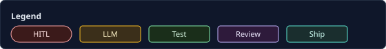
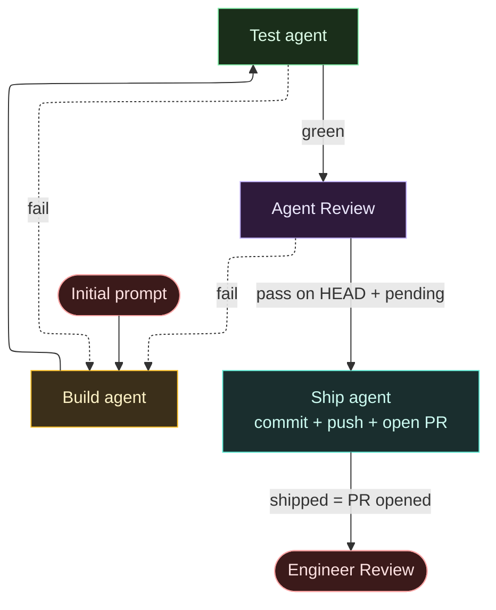

# Minimal ADW: Build → Test agent → Review → Ship agent

The first ADW is a coded graph: **Initial prompt** → **Build** (LLM) → **Test agent** (Code agent / check gates) → **Agent Review** (LLM, HEAD + pending worktree) → **Ship agent** (Code agent: schema `ShipInput` → commit-if-dirty + push + **open PR/MR**) → **Engineer Review** (HITL on the PR, outside automation). One **warm sandbox** per ticket holds Build through Ship. Test fail or Agent Review fail resumes **Build**. This matches ADR-0005 (orchestration owns pass/fail) and keeps LLM judgment off the hard Test gate and forge ops.

**Ship** here means “open the PR” (`shipped` = PR URL recorded) — **not** merge, deploy, or release. Merge stays human (or later automation outside this ADW).

Canonical diagram for **Minimal ADW** (Mermaid = human + agent). Feature ADW: human layout [`docs/diagrams/feature-adw.svg`](../diagrams/feature-adw.svg); **agents read Mermaid in** [`docs/VISION.md`](../VISION.md) §2. Format rules: [`docs/README.md`](../README.md#format-mermaid-vs-svg).

Dashed **fail** edges land on **Build** (resume same session). **GitHub** + ELK (`defaultRenderer: elk`) is the SoT for layout. Cursor Mermaid preview often ignores ELK and may yank Prompt off-top — ignore Cursor if GH looks right. Colors: [`docs/README.md` — ADW diagram colors](../README.md#adw-diagram-colors).

## Status

accepted

## Considered Options

- **Separate LLM “test agent” that writes or diagnoses tests** — rejected for v0; the Test agent is a Code agent that runs checks.
- **Ship as LLM agent (draft + forge + conflicts)** — rejected; forge stays credential-scoped and deterministic as a Code agent.
- **Ship as merge/deploy** — rejected; `shipped` means PR/MR opened (ADR-0011), not merged or released. Engineer Review / humans own merge.
- **New sandbox or fresh agent session on every Test failure** — rejected; burns tokens re-exploring; warm sandbox + resume is the product path.
- **HEAD-only Agent Review** — rejected; pending worktree must be in scope or Ship can land unreviewed dirt.
- **Conflating Agent Review with Engineer Review** — rejected; Engineer Review is post-`shipped` HITL on the PR.
