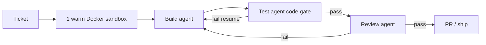

# Minimal ADW: Build → Test agent → Review

The first ADW is a coded graph: **Build** (LLM agent) → **Test agent** (coded gate: run tests/typecheck via the Runtime) → **Review** (LLM agent). One **warm sandbox** per ticket holds all steps. If the Test agent fails, orchestration resumes the Build agent in the **same session** and same sandbox with the gate output; if it passes, Review runs. Review failure may route back to Build. This matches ADR-0005 (orchestration owns pass/fail) and keeps LLM judgment off the hard gate.

## Status

accepted

## Considered Options

- **Separate LLM “test agent” that writes or diagnoses tests** — rejected for v0; the Test agent is code that runs checks.
- **New sandbox or fresh agent session on every Test failure** — rejected; burns tokens re-exploring; warm sandbox + resume is the product path.
